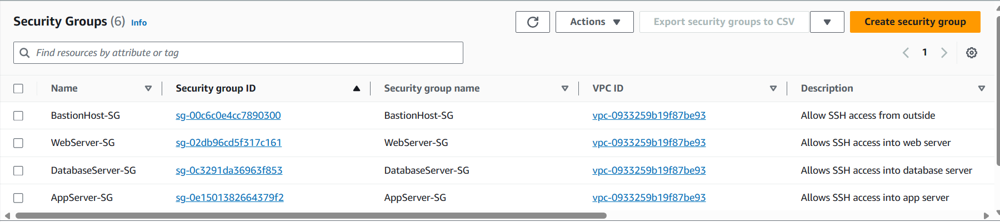

# Setting up a 3-Tier Application on AWS
## Introduction
✍️ Today, I designed and configured a 3-tier application on AWS as in the diagram. I chose to study and deploy a 3-tier application to gain hands-on experience specifically in designing and implementing scalable and resilient architectures, which are essential skills for modern software development and infrastructure management.

## Prerequisite

1. An AWS account (free-tier can be used)
2. AWS Global Architecture
3. Basics of networking and subnetting - VPC, Subnets, security groups, route-tables, internet gateway, NAT gateway
4. Linux
5. MySQL

## Use Case

- This architecture ensures security and scalability by segregating different tiers of the application. The web server serves content to users, the application server processes business logic, and the database server stores data. By deploying these components in separate layers, multiple availability zones and utilizing AWS services like VPC, EC2, RDS, and security groups, the application becomes resilient, highly available, scalable, and secure, meeting real-world demands effectively.

## Cloud Research

- During the process of setting up the 3-tier architecture on AWS, I encountered several trial and errors. Initially, I had to understand the concept of Bastion Hosts and their role in providing secure access to servers in private subnets. I researched documentation and tutorials to grasp the best practices for setting up VPC, subnets, gateways, and security groups. I used this article for reference: 
[AWS - Create a VPC with Public and Private Subnets and a NAT Gateway | Jason Watmore's Blog](https://jasonwatmore.com/post/2021/05/30/aws-create-a-vpc-with-public-and-private-subnets-and-a-nat-gateway#create-aws-vpc)

- I followed through this [Tier 3 High-Level Instructions](./Tier%203%20High%20Level%20Instructions.docx) provided in the project.

- As I proceeded with the configuration, I encountered challenges in properly configuring the security groups to allow SSH access from the Bastion Host to the Application Server while restricting other inbound traffic. I had to troubleshoot the inbound rules and adjust the configurations until the connectivity was established.

## Try yourself

✍️ Here's a mini tutorial you can follow along:

### Step 1 — Make VPC

#### VPC

#### Subnets

#### VPC Resource Path
- Create an internet gateway and NAT gateway and attach them to the VPC
- Create route tables 
    - public route - allows traffic through the internet gateway 0.0.0.0/0
    - private route - allows traffic through the nat gateway 0.0.0.0/0
- Associate the public subnet with the public route table, and the 3 private subnets associate them with the private route table.

#### Security Groups

#### Bastion SG

#### Web Server SG

#### App Server SG

#### DB SG

### Step 2 — Configure the Instances for each tier

#### EC2 Instances

- User data for Web Server:
#!/bin/bash
sudo yum update -y
sudo amazon-linux-extras install -y lamp-mariadb10.2-php7.2 php7.2
sudo yum install -y httpd
sudo systemctl start httpd to start up the webserver
sudo systemctl enable httpd to do it on reboot

- User data for App Server:
#!/bin/bash
sudo yum install -y mariadb-server
sudo service mariadb start

#### DB Subnet Group
- Two availability zones to make the application data highly available.

#### DB Instance - Amazon RDS

### Step 3 — Testing the Connection

#### SSH into Bastion Host

#### SSH into App Server from Bastion Host

#### Ping Web Server from App Server

#### Test Database Connection

## ☁️ Cloud Outcome

- One of the key lessons I learned was the importance of proper network segmentation and security in cloud environments. Understanding how to effectively partition resources into public and private subnets, and implementing security measures such as security groups and Bastion Hosts, is crucial for maintaining a secure and resilient infrastructure

- Moreover, I gained insights into networking components specific to AWS, such as Internet Gateways, NAT Gateways, and Elastic IP addresses, and how they facilitate connectivity and internet access within a VPC.

## Next Steps

I aim to further expand my knowledge and skills in designing highly available and scalable architecture by exploring advanced topics such as auto-scaling and elastic load balancer.

## Social Proof

[LinkedIn Post](https://www.linkedin.com/posts/jecinta-atieno_100daysofcloudchallenge-cloudcomputing-awscloud-activity-7171259440531230720-RB5O?utm_source=share&utm_medium=member_desktop)
